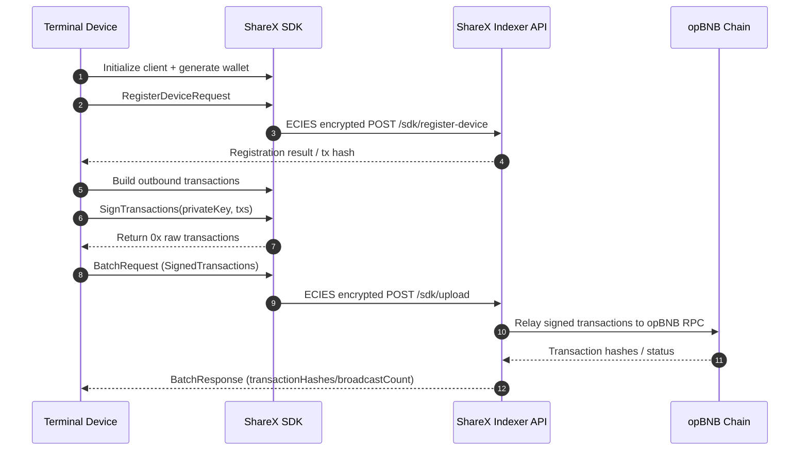

# ShareX Go SDK

This SDK serves ShareX terminals: devices generate wallets locally, talk only to
the ShareX Indexer API, and rely on **public-key encryption** to upload
device-registration details and batched transaction data. The server decrypts
with its private key and forwards payloads to the Deshare contracts.

## Feature Overview

- secp256k1 wallet generation/import (`GenerateWallet`, `WalletFromPrivateKey`).
- ECIES (secp256k1) public-key encryption so every request body becomes
  ciphertext via the Indexer key, keeping device identifiers and wallet
  addresses off the wire.
- Indexer integrations: `/sdk/register-device` (register device) and
  `/sdk/upload` (batch submission) both run through the encrypted channel.
- Unified error wrapper `APIError` to quickly inspect HTTP status codes and
  response bodies.

## Installation

```bash
go get github.com/sharex-org/sharex-sdk-go
```

## Quick Start

```go
package main

import (
    "context"
    "log"

    "github.com/sharex-org/sharex-sdk-go"
)

func main() {
    client, err := sharex.NewClient(sharex.Config{
        IndexerBaseURL:         "https://indexer-api.sharex.network",
        EncryptionPublicKeyHex: "<sharex-indexer-public-key>", // Uncompressed secp256k1 public key (0x04...)
    })
    if err != nil {
        log.Fatal(err)
    }

    // 1. Generate a wallet on the device
    wallet, err := sharex.GenerateWallet()
    if err != nil {
        log.Fatal(err)
    }

    // 2. Register the device through an encrypted request
    if _, err := client.RegisterDevice(context.Background(), sharex.RegisterDeviceRequest{
        DeviceID:    "DEVICE001",
        DeviceType:  "Terminal",
        PartnerCode: "TECH001",
        MerchantID:  "MERCH001",
        WalletAddr:  wallet.Address,
    }); err != nil {
        log.Fatal(err)
    }

    // 3. 生成一笔调用真实 Deshare 合约 uploadTransactionBatch 的已签名交易
    //    - 合约地址&链 ID 默认指向主网: 0x28e3889A3bc57D4421a5041E85Df8b516Ab683F8, chainId=204
    //    - SDK 自动压缩 transactionData（FastLZ）并 ABI pack
    signedTx, err := sharex.BuildSignedUploadBatchTx(sharex.UploadBatchTxParams{
        PrivateKeyHex:       wallet.PrivateKeyHex,
        Nonce:               0,                      // 从 RPC 查询 pending nonce
        DateComparable:      "20250131",
        DeviceID:            "DEVICE001",
        TransactionDataJSON: `{"transactions":[{"id":1,"factOvertimeMoney":"99.99","deviceTerminal":"DEVICE001"}]}`,
    })
    if err != nil {
        log.Fatal(err)
    }

    batch := sharex.BatchRequest{
        DeviceID:           "DEVICE001",
        DateComparable:     "20241108",
        OrderCount:         1,
        TotalAmount:        "99.99", // 与交易数据保持一致
        SignedTransactions: []string{signedTx},
    }
    if _, err := client.SubmitTransactionBatch(context.Background(), batch); err != nil {
        log.Fatal(err)
    }
}
```

Device requests rely solely on the ECIES public key for encryption and implicit
auth, so no `x-api-key` header is required. Keep
`EncryptionPublicKeyHex` in sync with the Indexer configuration.

### 关于默认链和合约
- `DefaultDeshareContractAddress = 0x28e3889A3bc57D4421a5041E85Df8b516Ab683F8`
- `DefaultOpBNBChainID = 204`
- 在 `BuildSignedUploadBatchTx` 中未填 `ContractAddress` 或 `ChainID` 时自动落到上述默认值；如需测试网请显式传入。

## Interaction Flow



## Encryption Pipeline

1. `RegisterDeviceRequest` or `BatchRequest` is serialized to JSON.
2. The SDK reads `EncryptionPublicKeyHex` and runs ECIES (secp256k1) with a
   random session key to encrypt the JSON.
3. The payload sent to the Indexer always looks like:
   ```json
   {
     "payload": "<base64-cipher-text>"
   }
   ```
4. The Indexer decrypts with its private key before inserting the device or
   writing the batch on-chain.

Therefore, proxies outside of the Indexer or its gateway cannot capture device
IDs, wallet addresses, or transaction details.

## Request Fields

### Device Registration `RegisterDeviceRequest`

| Field           | Description                                                    |
| --------------- | -------------------------------------------------------------- |
| `deviceId`      | Unique device identifier (hardware serial, secure element ID). |
| `deviceType`    | Device class (Terminal/Mobile/...).                            |
| `partnerCode`   | Partner identifier.                                            |
| `merchantId`    | Merchant identifier.                                           |
| `walletAddress` | Device wallet address (EVM).                                   |

### Batch Upload `BatchRequest`

| Field                | Description                                                               |
| -------------------- | ------------------------------------------------------------------------- |
| `deviceId`           | Previously registered device ID.                                          |
| `dateComparable`     | `YYYYMMDD` string used for server-side windowing.                         |
| `orderCount`         | Number of records inside the batch (>0).                                  |
| `totalAmount`        | Aggregate amount encoded as a string to avoid floating-point drift.       |
| `signedTransactions` | Array of signed raw transactions (0x+hex) that the Indexer relays to RPC. |

## Error Handling

All 4xx/5xx responses are converted into `*sharex.APIError` (with
`StatusCode`, `Message`, and `Body`). Use `errors.As(err, *sharex.APIError)` to
inspect the status and implement retries or key renegotiation strategies.

## Testing

```bash
cd sharex-sdk-go && go test ./...
```

Tests cover:
- ECIES encryption/decryption correctness.
- Whether the register/batch flows send ciphertext that the mock server can
  restore.
- Core utilities such as URL normalization and validation helpers.

Follow the repository guidelines in `AGENTS.md`: keep `gofmt`, ship tests with
new capabilities, and extend `Routes` if you need multiple environments.

## Demo: Wallet Export + End-to-End Validation

```bash
go run ./cmd/demo
```

This single binary now demonstrates the full lifecycle:

- Generates a wallet, saves the private key to a temp `sharex-wallet-*.key` file with `0600` permissions, and reloads it via `WalletFromPrivateKey` to prove deterministic recovery.
- Spins up a mock Indexer, registers the device with ECIES-encrypted payloads,并用 `BuildSignedUploadBatchTx` 生成一笔调用生产 Deshare 合约的已签名交易（默认 chainId=204，合约地址已内置），再通过 `/sdk/upload` 的加密通道提交。

Use the printed wallet path if you want to inspect or back up the key; delete it once you're done.

`cmd/demo` ships a minimal example that starts a mock Indexer locally:

1. The server generates a key pair, exposes the public key, and keeps the
   private key for decryption.
2. The SDK device generates a wallet, calls `RegisterDevice`, and the server
   decrypts/logs the device data.
3. The SDK constructs a batch, calls `SubmitTransactionBatch`, and the server
   decrypts/logs the batch statistics.

Run it with:

```bash
cd sharex-sdk-go
go run ./cmd/demo
```

The terminal prints the device wallet, registration result, batch outcome, and
mock server logs, confirming the “wallet → encrypted request → decrypted
processing” loop.
